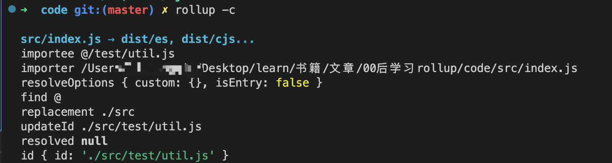

# 00后学习rollup plugin

## 1. 前言

rollup文档链接：https://www.rollupjs.com/guide/plugin-development

学习第一步，阅读文档。

正如官方文档所说的，rollup plugin本质就是一个 包含 属性（properties）, 构建钩子（build hook），

输出生成钩子（output generation hooks） 的对象（object）。

## 2. 举例

```js
// rollup-plugin-my-example.js
export default function myExample () {
  return {
    name: 'my-example', // this name will show up in warnings and errors
    resolveId ( source ) {
      if (source === 'virtual-module') {
        return source; // this signals that rollup should not ask other plugins or check the file system to find this id
      }
      return null; // other ids should be handled as usually
    },
    load ( id ) {
      if (id === 'virtual-module') {
        return 'export default "This is virtual!"'; // the source code for "virtual-module"
      }
      return null; // other ids should be handled as usually
    }
  };
}

```

## 3. 起因

与众多的构建工具一样，在一个真实的项目场景中，rollup本身提供的能力未必能满足复杂的构建需求。

如果把处理逻辑跟打包的逻辑混在一起，就会导致与rollup配置相关的核心代码显得特别臃肿，也不利于维护。

所以，Rollup 设计出了一套完整的插件机制，可根据不同的构建需求引入对应的插件。

## 4. 方向

在Rollup 的打包过程中，会定义一套完整的构建生命周期，从开始打包到产物输出，中间会经历多个阶段，

同时在不同的阶段会执行对应的插件钩子函数(Hook)。

所以，记忆并理解rollup的插件钩子函数是学习rollup plugin的重要方向。

## 5. 整体

从整体的角度来说，rollup一次完整的构建周期可分为两大阶段，build（构建）和output（输出）阶段。

**build阶段：**解析各模块的内容，根据模块间的依赖关系构建依赖图。

**output阶段：**代码的打包与输出

## 6. 分类

对于rollup插件钩子的类型，我们可以进行一个分类。

（1）**分类标准**：钩子执行时所处的阶段

**build hook**

 主要事情：模块代码 -> 抽象语法树（AST），AST -> 目标代码，模块依赖图的构建与解析

 操作粒度：单个模块，单个文件

**output hook**

主要事情：多个代码的打包

操作粒度： chunk级别，多个模块组成

（2）**分类标准**：钩子执行的方式，官方分类，可叠加

**async：**异步的钩子 （return a promise resolving to the same type of value）

**sync：**同步的钩子

**first：**如果有多个插件实现了这个 Hook，那么 Hook 将依次运行，直到返回一个非 null 或非 undefined 的值为止。

**sequential：**串行的钩子函数，如果有几个插件实现了这个钩子，它们都会按照指定的插件顺序运行。如果一个钩子是异步的，则此类后续钩子将等待当前挂钩被解析。这种 Hook 往往适用于插件间处理结果相互依赖的情况，即前一个插件 Hook 的返回值作为后续插件的入参。

**parallel：**并行的钩子函数, 各走各的，互不干扰。

## 7. 解读

下面我将从rollup的钩子函数中提取一部分，简单介绍下 rollup 的完整工作流程。

（1）options：串行钩子，解析配置文件，得到新的配置对象。

（2）buildStart:  并行钩子，开始构建流程。

（3）resolveId：first钩子，从入口文件开始解析文件的路径，只有一个插件的resolveId返回了路径，其余插件的resolveId也就会停止执行。

（4）load：first钩子，加载模块内容。

（5）transform：串行钩子，根据模块依赖图确定指定顺序，执行所有的transform钩子，对于模块内容进行转换，例如把es6转换成es5。

（6）在解析模块路径时，如果是external（排除）属性，则跳过打包过程。

（7）resolveDynamicImport：first钩子，如果遇到动态import请求，解析路径成功后会跳到load钩子，加载模块内容。解析路径失败或者是普通的import请求，则会跳转resolveId继续解析路径。

（8）buildEnd：并行钩子，构建阶段结束。

（9）outputOptions：串行钩子，读取output配置。

（10）renderStart：并行钩子，开始打包。

（11）banner、footer、intro、outro钩子：并行钩子，在打包产物的固定位置(比如头部和尾部)插入一些自定义的内容，比如协议声明内容、项目介绍等等。

（12）renderChunk：串行钩子，可获取到chunk 代码内容和chunk 元信息。

（13）generateBundle：串行钩子，产物生成前的最后一步。可获取到output配置和打包产物的元信息，通过操作元信息可以删除一些无用的chunk，也可以输出自定义的新资源。

（14）writeBundle：并行钩子，产物已生成。

（15）closeBundle:  并行钩子，打包结束。

## 8. 实战

下面 是 rollup插件 @rollup/plugin-alias的源码，功能：设置路径的别名。

```js
// 判断路径是否匹配
function matches(pattern, importee) {
    if (pattern instanceof RegExp) {
        return pattern.test(importee);
    }
    if (importee.length < pattern.length) {
        return false;
    }
    if (importee === pattern) {
        return true;
    }
    // eslint-disable-next-line prefer-template
    return importee.startsWith(pattern + '/');
}

function getEntries({
    entries, 
    customResolver // 自定义路径解析方法
}) {
    if (!entries) {
        return [];
    }
    const resolverFunctionFromOptions = resolveCustomResolver(customResolver);
    if (Array.isArray(entries)) {
        return entries.map((entry) => {
            return {
                find: entry.find,
                replacement: entry.replacement,
                resolverFunction: resolveCustomResolver(entry.customResolver) || resolverFunctionFromOptions
            };
        });
    }
  	// 解析成一个对象，例如路径中’@‘->'./src'
    return Object.entries(entries).map(([key, value]) => {
        return {
            find: key,
            replacement: value,
            resolverFunction: resolverFunctionFromOptions
        };
    });
}

function getHookFunction(hook) {
    if (typeof hook === 'function') {
        return hook;
    }
    if (hook && 'handler' in hook && typeof hook.handler === 'function') {
        return hook.handler;
    }
    return null;
}

function resolveCustomResolver(customResolver) {
    if (typeof customResolver === 'function') {
        return customResolver;
    }
    if (customResolver) {
        return getHookFunction(customResolver.resolveId);
    }
    return null;
}

function alias(options = {}) {
    const entries = getEntries(options);
    if (entries.length === 0) {
        return {
            name: 'alias',
            resolveId: () => null
        };
    }
    return {
        name: 'alias',
        async buildStart(inputOptions) {
            await Promise.all([...(Array.isArray(options.entries) ? options.entries : []), options].map(({
                customResolver
            }) => {
                var _a;
                return customResolver && ((_a = getHookFunction(customResolver.buildStart)) === null || _a === void 0 ? void 0 : _a.call(this, inputOptions));
            }));
        },
        resolveId(importee, importer, resolveOptions) {
          /*
importee，当前资源路径（import ‘xx’语句中的xx原始字符串）
importer，被哪个模块导入的，父模块的路径（一般是绝对路径，如果importee是入口文件，则该值为undefined。表示没有父模块导入它）。
resolveOptions，可能用到的一些配置。比如isEntry: boolean，当前impotee文件是不是入口文件之类的。
*/
            if (!importer) {
                return null;
            }
            // First match is supposed to be the correct one
            const matchedEntry = entries.find((entry) => matches(entry.find, importee));
            if (!matchedEntry) {
                return null;
            }
          	//匹配成功，路径替换
            const updatedId = importee.replace(matchedEntry.find, matchedEntry.replacement);
       		// resolverFunction对应选项中的customResolver，自定义的路径解析算法
            if (matchedEntry.resolverFunction) {
                return matchedEntry.resolverFunction.call(this, updatedId, importer, resolveOptions);
            }
          	// this.resolve是rollup自带的路径解析算法，返回一个资源对象
            return this.resolve(updatedId, importer, Object.assign({
                skipSelf: true
            }, resolveOptions)).then((resolved) => resolved || {
                id: updatedId
            });
        }
    };
}

export {
    alias as
    default
};
//# sourceMappingURL=index.js.map
```

