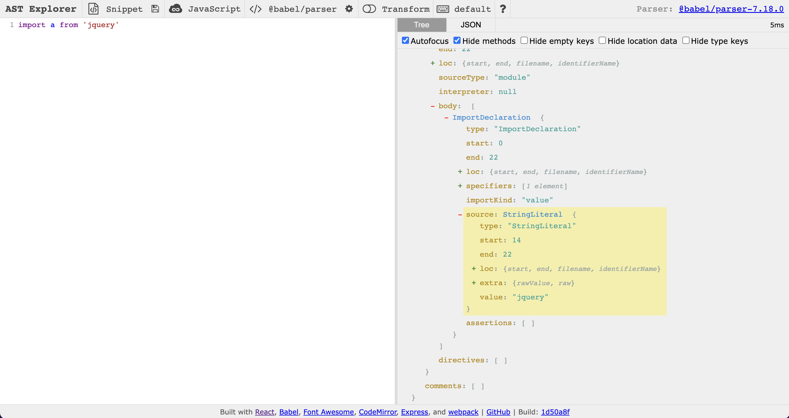
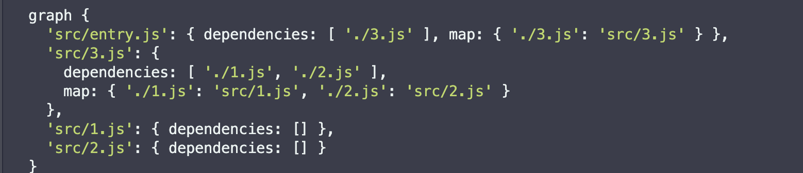
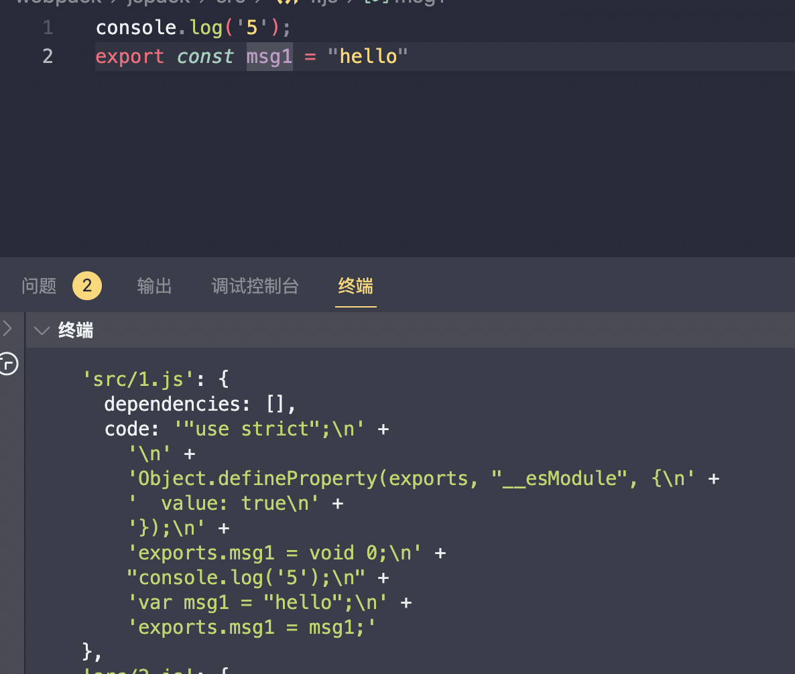

# 00后手写一个js打包器

## 1. 前言

  作为一名刚工作的前端萌新，我对 javaScript 文件的打包机制理解并不深刻，所以下面我将从一个初学者的角度来尝试手写一个简单的js打包器，附加学习内容和心路历程。

## 2. 思路

  在手写一个js打包器之前，我先打开了webpack中文文档，下面这是文档的第一句。

  本质上，*webpack* 是一个现代 JavaScript 应用程序的*静态模块打包器(module bundler)*。当 webpack 处理应用程序时，它会递归地构建一个*依赖关系图(dependency graph)*，其中包含应用程序需要的每个模块，然后将所有这些模块打包成一个或多个 *bundle*。

  看完这句，思路是不是就来了？

  首先，我的目标并没有webpack那么伟大，我要做的只是一个js打包器，而不是一个模块打包器。而模块这一概念对应着webpack的loader机制【根据不同的文件类型，采取不同的loader，将其转译成webpack可读取的模块，这就意味着我们可以在javascript代码中以模块化的形式载入任意形式的资源文件，例如样式文件，css文件】

  同时，webpack可以实现分块打包，这样在浏览器首次渲染时可以先加载部分的js文件，剩下的js文件可以通过页面交互来获取，这种渐进式加载的思想很适合现代化的大型应用。考虑到作者水平有限，这个功能也不做了。

 那么，实现js打包器的第一步就变成了 如何实现js文件的递归构建依赖关系图(dependency graph)？

## 3. 探索

**第1步**:  如何知道一个js文件中引入了哪些文件？  

下面是我的方案： 

<https://astexplorer.net/>

如下图所示，我想到先用babel parse 阶段的目的是把源码字符串转换成机器能够理解的 AST。

通过分析抽象语法树的结构来尝试获取import的文件路径。

```javascript
const dependencies = [];
traverse(ast, {
    ImportDeclaration: ({
      node
    }) => {
      dependencies.push(node.source.value)
    }
})
```



**第2步**:  定义一个依赖关系图的结构【key为绝对路径，value值为资源对象】

dependencies 依赖数组 每一项对应着一个js文件的相对路径。

```jsx
const assert = getDepArray(entry);//得到资源对象，包含依赖数组
const graph = { //entry为入口文件的路径
      [entry]: assert
}
/*
通过遍历依赖数组里的每一项【相对路径】，得到绝对路径，记录到map属性。
判断是否出现每一项对应的绝对路径是否在依赖关系图中有记录，
若没有，则进行计算其依赖数组，然后开始递归调用，直到
某路径对应的依赖数组长度为0时停止。
*/
```



**第3步**: 得到这张依赖关系图后，我们需要对应的代码拼装起来，但是这里的代码指的并不是源代码，而是babel插件根据AST解析出的目标代码，src目录的代码是es module规范。

```jsx
const ast = parser.parse(content, {
        sourceType: "module"
})
transformFromAstSync(ast, null, {
       presets: ['@babel/preset-env'],
}).code
```



**第4步**:  经过对比，我们可以看出源代码与目标代码之间是有差异的。【注意exports这个变量】

通过查阅资料，我从**Common JS 规范**找到了如何把多个目标代码最终合并成一个js的思路。


## 4. Common JS规范

在学习一个新概念的时候，我们可以先想清楚它为什么会出现，解决了什么问题？

```js
// a.js
var name = 'I am a.js'

// b.js
var name = 'I am b.js'

// index.html
<script type="text/javascript" src="/a.js"></script>
<script type="text/javascript" src="/b.js"></script>

```

在a.js中有一个变量"name"，在b.js中也有一个变量"name"，那么用script标签加载这两个js脚本,那么最终name的值是哪一个？

**答案：**b.js中的name变量覆盖了a.js中的name变量，这种情况我们称之为命名冲突。

对于避免污染全局作用域的行为，我们都能想到一个很常见的手段，立即执行函数。

```jsx
(
  function(){
    var name = 'I am a.js'
  }
)()
// 上面的写法虽然实现了私有变量的封装，但是有时需要导出一些变量和函数。

// a.js
// 运行这个脚本，将执行下面这个匿名函数，这个函数会返回一个函数moduleFn
// module函数接收一个object对象，把a.js要导出的变量放在这个对象里面
(
  function(){
    return function moduleFn(object){
      object.name = "I am a.js"
    }
  }
)()

// main.js
var exports = {}  // 准备一个空对象用来保存a.js导出的变量
eval(readFile('./a.js'))(exports)
console.log(exports.name)

// 封装一下
function require( modulePath ){
  var exports = {}
  eval(readFile(modulePath))(exports)
  return exports
}

// main.js
var a = require('./a.js')

// node.js最开始的导入模块规范：CommonJS模块大致上就是这种思想。
```

这时，又有一个新的情况。

**假设**：a.js 和 b.js 共用一个c.js这个模块，c.js 会计算圆周率，数据量很大，我们希望a.js和b.js共享起来，而不是引用一次计算一次，并且a.js和b.js拿到的应该是同一个对象，所以我们需要把每次加载的模块都保存起来。

```jsx
var cache = {}  // 保存加载过的模块
function require( modulePath ){
  if(cache[modulePath]) return cache[modulePatch]
  var module = {
    path: modulePath,  // 模块路径
    exports: {},  // 保存模块导出的变量
  }
  cache[modulePatch] = module
  eval(readFile(modulePatch))(module,module.exports)
  return module.exports
}
//为了实现导出函数，module对象和module.exports都作为参数。
(
  function(){
    return function moduleFunction(module,exports){
      module.exports = function(){}  // 直接导出一个函数
      exports.fn1 = function(){} // 把函数作为对象的方法
    }
  }
)()
// 这也就符合了在学习Node.js时，经常能看到两种导出模块的方式：module.exports和exports。
```

**Common JS 规范最重要的就是三个对象**
**module: 保存当前模块的信息，是一个Object**
**exports：用于导出模块变量的对象**
**require：用于导入模块的函数**

那么，我们在写node.js时为什么没有一个函数需要接受这三个对象呢，那当然是因为node.js在解析源代码时做了处理！

```jsx
// a.js
var test = require('b.js')
module.exports = function(){}
//node解析上述代码时会首先把a.js文件内容读进去，然后进行编译。
content = fs.readFileSync('a.js','utf8')
module._compile(content,'a.js') // 读出来调用_compile函数进行编译


// _compile 函数调用wrapSafe把a.js包裹成一个函数
const compileWrapper = wrapSafe(filename,content,this)

//  wrapSafe 函数中调用 Module.wrap 包裹content字符串
const wrapper = Module.wrap(content)

// Module.wrap函数对content的包裹
const wrapper=[
  '(function(exports,require,module,_filename,_dirname){',
  '\n})'
]
return Module.wrapper[0] + script + Module.wrapper[1]

// 调用wrap函数包裹后,wrapper的值为：
const wrapper = `
  (function(exports,require,module,_filename,_dirname){
    var test = require('b.js')
    module.exports = function(){}
  })
`

// 我们运行这个字符串，compileWrapper 最后得到一个函数
const compileWrapper =  (function(exports,require,module,_filename,_dirname){
    var test = require('b.js')
    module.exports = function(){}
})

// 然后调用compileWrapper，并且传入module,epxports,require
result = compileWrapper.call(thisValue,exports,require,module,filename,dirname)

/*
可以看的出来包裹后的函数多了添加_filename和_dirname，用于只是当前js文件的文件名和所在目录。module在Node.js中是一个Module实例
Module {
  id: '', // 模块ID，用于唯一识别一个模块，通常是绝对路径
  path: '', // 模块路径
  exports: {}, // 保存模块的导出变量
  parent: null | Module, //父级模块
  filename: '',  // 模块的文件路口
  loaded: true | false , // 模块是否加载完毕
  children: Module [], // 模块内加载的其他模块
  path: [], // 查找模块产生的路径
}
*/

```

## 5. 回归

 问题回到如何将各路径下的js文件拼接成一个js文件，根据AST生成的代码并不是闲的无聊，才加个没声明过的变量exports，exports是用于导出模块变量的对象。

合并js文件的思路：模仿node.js编译源代码时内部的处理，做一个模块包装器。

```jsx
/*
模块包装器

在执行模块代码之前，Node.js 会使用一个如下的函数包装器将其包装：
(function(exports, require, module, __filename, __dirname) {
		// 模块的代码实际上在这里
});
通过这样做，Node.js 实现了以下几点：

1.它保持了顶层的变量（用 var、const 或 let 定义）作用在模块范围内，而不是全局对象。 (其实就是用闭包，使模块里定义的变量或函数有自己的作用域，避免全集作用域污染。而且模块里面的变量，函数，类都是私有的，对外不可见，需要对外公开的接口，可以赋值给module.exports属性或exprots变量)

2.它有助于提供一些看似全局的但实际上是模块特定的变量，例如：实现者可以使用 module 和 exports 对象从模块中导出值，快捷变量 filename 和 dirname 包含模块的绝对文件名和目录路径。

*/

// 最终实现打包代码
function bundle(graph) {
    let modules = ''
    for (let key in graph) {
        let {
            code,
            map
        } = graph[key]
        modules += `'${key}': [
        function(require, module, exports) {
          ${code}
        },
        ${JSON.stringify(map)},
      ],`
    }
    const result = `
      (function(modules) {
        function require(moduleId) {
          const [fn, map] = modules[moduleId]
          const module = {exports: {}}
          fn((name)=>require(map[name]), module, module.exports)
          return module.exports
        }
        require('${entry}')
      })({${modules}})
    `
    return result
}
fs.writeFile('dist/index.js', bundle(createGraph(entry)), err => {
    console.log('err', err);
})
```

## 6. 结果

最终打包的结果就是一个立即执行函数，传入的参数是一个对象。

**key：仍然是依赖分析图中的绝对路径**

**value：一个模块包装器函数，里面包含的是路径对应的目标代码和对应的绝对路径。**

**module：保存当前模块的信息**
**exports：用于导出模块变量的对象**
**require：用于导入模块的函数**

这里的require函数是我们自定义的一个递归函数，
从入口的绝对路径开始，传入相对路径，然后根据构建好的依赖图得到绝对路径。

```jsx
(function (modules) {
  function require(moduleId) {
    const [fn, map] = modules[moduleId]
    const module = {
      exports: {}
    }
    fn((name) => require(map[name]), module, module.exports)
    return module.exports
  }
  require('src/entry.js')
})({
  'src/entry.js': [
    function (require, module, exports) {
      "use strict";

      var _ = require("./3.js");

      var _2 = require("./1.js");

      var _3 = require("./2.js");

      (0, _.print)();
      console.log('城');
      console.log(_2.msg1, _3.msg2, _2.msg1);
    },
    {
      "./3.js": "src/3.js",
      "./1.js": "src/1.js",
      "./2.js": "src/2.js"
    },
  ],
  'src/3.js': [
    function (require, module, exports) {
      "use strict";

      Object.defineProperty(exports, "__esModule", {
        value: true
      });
      exports.msg3 = void 0;
      exports.print = print;

      function print() {
        console.log('同');
      }

      var msg3 = "同城";
      exports.msg3 = msg3;
    },
    undefined,
  ],
  'src/1.js': [
    function (require, module, exports) {
      "use strict";

      Object.defineProperty(exports, "__esModule", {
        value: true
      });
      exports.msg1 = void 0;
      console.log('5');
      var msg1 = "hello";
      exports.msg1 = msg1;
    },
    undefined,
  ],
  'src/2.js': [
    function (require, module, exports) {
      "use strict";

      Object.defineProperty(exports, "__esModule", {
        value: true
      });
      exports.msg2 = void 0;
      console.log('8');
      var msg2 = ",58";
      exports.msg2 = msg2;
    },
    undefined,
  ],
})
```

## 7. 填坑

写到这里，作者曾一度觉得大功告成了，最后发现还是漏了一个细节，但是nodejs其实已经提供了方案。

当不同模块之间存在相互依赖时，之前的代码会有bug。

```jsx
//1.js ，先运行1.js
import {
    xunhuan2
} from './2.js';
console.log('5');
console.log(xunhuan2); 
export const msg1 = "hello"
export const xunhuan1 = "1";

//2.js
import {
    xunhuan1
} from "./1.js";
console.log(xunhuan1);//打印结果为undefined
console.log('8');
export const xunhuan2 = "2";
export const msg2 = ",58"
```

上文介绍Common JS规范时，每次加载的模块都会保存起来。

这不仅仅是为了避免重复加载模块，尤其是比较复杂的模块，同时还解决了这种相互依赖会卡死的问题。

其实代码原理很简单，当模块还没加载完，module的exports可能还是个空对象，根据缓存自然就认为是undefined了。因为对象是引用数据类型，当模块加载完时，陆续到位的数据其实还是能通过缓存访问到的。

```jsx
(function (modules) {
  var cachedModules = {};
  function require(moduleId) {
    if (cachedModules[moduleId]) return cachedModules[moduleId].exports;
    const [fn, map] = modules[moduleId]
    const module = cachedModules[moduleId] = {
      exports: {}
    }
    fn((name) => require(map[name]), module, module.exports)
    return module.exports
  }
  require('src/entry.js')
})
```

## 8 总结

##### 源码：